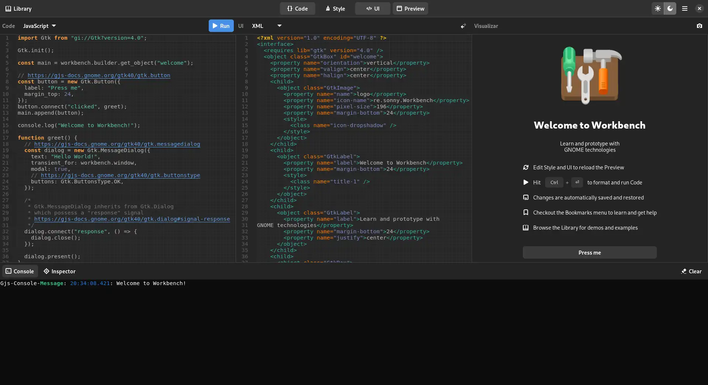
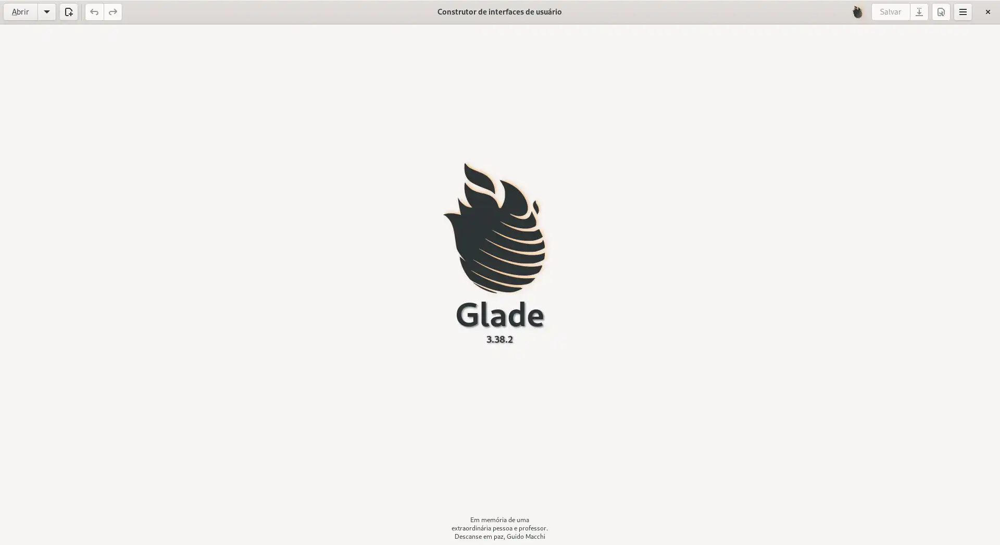
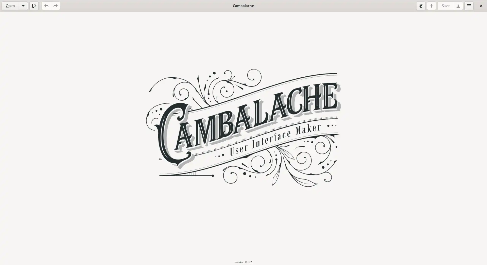
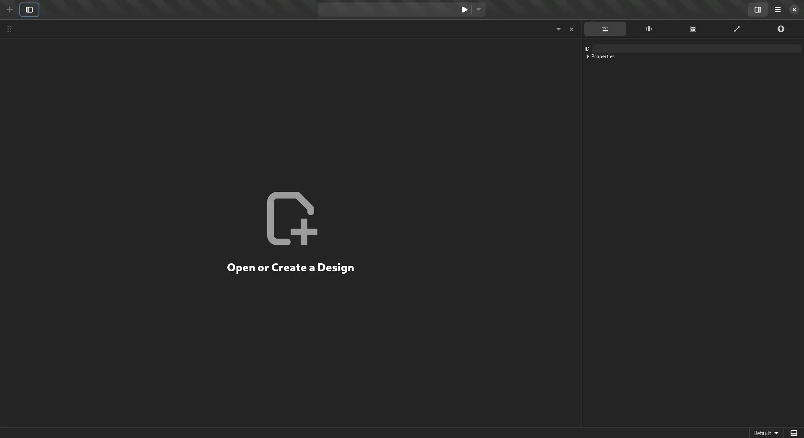
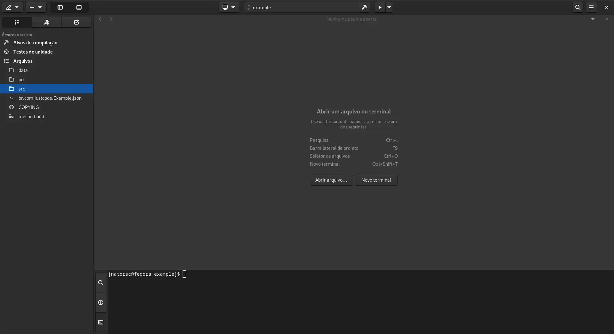
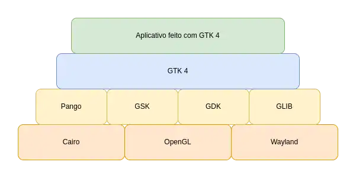

 e Gtk 4")

<br>

[](https://github.com/natorsc/gui-python-pygobject-gtk4 "Ir para o repositório.")
&emsp;
[](https://github.com/natorsc/gui-python-pygobject-gtk4)
&emsp;
[](https://github.com/natorsc/gui-python-pygobject-gtk4)

[](https://github.com/natorsc/gui-python-pygobject-gtk4)

# Criando interfaces gráficas com Python (PyGObject) e Gtk 4

## 📝 Descrição

Repositório criado para documentar e centralizar conteúdos, dicas, tutoriais e exemplos de código sobre a construção de interfaces gráficas com a linguagem de programação Python (PyGObject) e o toolkit gráfico Gtk 4.

---

## 🛠 Tecnologias utilizadas

Até o presente momento as seguintes tecnologias estão sendo utilizadas na construção do projeto:

[](https://www.python.org/ "Ir para o site.")
&emsp;
[](https://pypi.org/project/PyGObject/ "Ir para o PyPi.")
&emsp;
[](https://www.gtk.org/ "Ir para o site.")
&emsp;
[](https://www.gnome.org/ "Ir para o site.")
&emsp;
[](https://flatpak.org/ "Ir para o site.")

---

## 🤓 Autor

Feito com 💙 por [Renato Cruz](https://github.com/natorsc) 🤜🤛 Entre em contato!

[](mailto:zkpcvm6dz@mozmail.com "Enviar e-mail.")
&emsp;
[](https://www.linkedin.com/in/natorsc "Entre em contato.")

Uma das playlist que costumo ouvir quando estou estudando ou "codando" 😁:

[](https://open.spotify.com/playlist/1xf3u29puXlnrWO7MsaHL5?si=A-LgwRJXSvOno_e6trpi5w&utm_source=copy-link "Acessar playlist.")

Sempre que possível escrevo tutoriais no meu blog pessoal 🚀:

[](https://blog.codigoninja.dev/ "Ir para o blog.")

---

## 💝 Doações

### Ko-Fi

[](https://ko-fi.com/natorsc "Ajude com uma doação.")

### Pix


**Chave**: `b1839493-2afe-484d-9272-82a3e402b36f`

---

## 🎓 Tutoriais

- [Python e Gtk 4: Preparando o ambiente de desenvolvimento no Linux](https://blog.justcode.com.br/python-e-gtk-4-preparando-o-ambiente-de-desenvolvimento-no-linux).
- [Python e Gtk 4: Preparando o ambiente de desenvolvimento no Windows](https://blog.justcode.com.br/python-e-gtk-4-preparando-o-ambiente-de-desenvolvimento-no-windows).
- [Como ativar a ferramenta de depuração interativa Gtk Inspector](https://blog.justcode.com.br/como-ativar-a-ferramenta-de-depuracao-interativa-gtk-inspector).
- [Como instalar o aplicativo Gtk 4 icon browser](https://blog.justcode.com.br/como-instalar-o-aplicativo-gtk-4-icon-browser).
- [Python e Gtk 4: Conhecendo o IDE Gnome Builder](https://blog.justcode.com.br/python-e-gtk-4-conhecendo-o-ide-gnome-builder).
- [Python e Gtk 4: Classes de estilo utilizadas pelo Gtk 4 e libadwaita](https://blog.justcode.com.br/python-e-gtk-4-classes-de-estilo-utilizadas-pelo-gtk-4-e-libadwaita).

---

## 🔗 Links uteis

### Documentação

- [Documentação Gtk 4](https://docs.gtk.org/gtk4/).
- [Documentação libadwaita](https://gnome.pages.gitlab.gnome.org/libadwaita/doc/).
- [Guia para desenvolvedores](https://developer.gnome.org/).
- [GNOME Human Interface Guidelines](https://teams.pages.gitlab.gnome.org/Design/hig-www/index.html).

### Softwares

- [Softwares que fazem parte do "circulo" do Gnome](https://apps.gnome.org/pt-BR/#circle).
- [Workbench](https://beta.flathub.org/apps/details/re.sonny.Workbench):

    

<br>

#### RADs

- [Gnome Glade](https://glade.gnome.org/). Não é mais recomendado para o desenvolvimento com Gtk 4:

    

<br>

- [Cambalache](https://flathub.org/apps/details/ar.xjuan.Cambalache) (Em desenvolvimento):

    

<br>

- [Gnome Drafting](https://gitlab.gnome.org/chergert/drafting) (Em desenvolvimento):

    

<br>

#### IDEs

- [Gnome Builder](https://wiki.gnome.org/Apps/Builder):
    
    

<br>

#### Icons

- [IconLibrary](https://flathub.org/apps/details/org.gnome.design.IconLibrary).
- [Icon Browser](https://blog.codigoninja.dev/como-instalar-o-aplicativo-gtk-4-icon-browser).

---

## Sobre o Gtk

O [GTK](https://www.gtk.org/) é um toolkit multiplataforma para a criação de interfaces gráficas.

O mesmo utiliza licença GNU LGPL, o que permite a sua utilização para construção de softwares que sejam livres ou proprietários.

Foi desenvolvido inicialmente para o GIMP (GNU Image Manipulation Program), por isso foi batizado de GIMP Toolkit ou simplesmente GTK.

Originalmente criado por, Peter Mattis, Spencer Kimball e Josh MacDonald.

O GTK é comumente utilizado na elaboração de aplicativos para o ambiente de desktop GNOME, contudo por ser multiplataforma pode ser executado sem problemas em diversos sistemas operacionais e ambientes gráficos.

O toolkit é escrito em C e o seu design é orientado a objeto com base no sistema de objetos da biblioteca GLib.

Existe o suporte a diversas linguagens de programação (bindings), contudo as linguagem que são **suportadas oficialmente** (até o momento que escrevo) são:

- [C++](https://www.cplusplus.com/).
- [C#](https://docs.microsoft.com/pt-br/dotnet/csharp/).
- [C](https://pt.wikipedia.org/wiki/C_(linguagem_de_programa%C3%A7%C3%A3o)).
- [JavaScript](https://www.javascript.com/).
- [Python](https://www.python.org/).
- [Rust](https://www.rust-lang.org/pt-BR).
- [Vala](https://wiki.gnome.org/Projects/Vala).

Sempre que possível de preferencia por iniciar um projeto utilizando o Gnome Builder.

> 🚨 O Gnome Builder não está disponível para Microsoft Windows.

---

## Gtk 4

O GTK 4 foi lançado em 16 de dezembro 2020.

No GTK 4 é desencorajado o uso do Gnome Glade, isso porque o **Gnome Builder** fornece uma forma padronizada e moderna de se
criar e gerenciar os projetos.

### Arquitetura



### bibliotecas:

#### [GLib](https://docs.gtk.org/glib/)

GLib é uma biblioteca central de baixo nível que forma a base do GTK. Ele fornece manipulação de estrutura de dados para C, wrappers de portabilidade e interfaces para funcionalidade de tempo de execução como um loop de eventos, threads, carregamento dinâmico e um sistema de objetos.

#### [Pango](https://docs.gtk.org/Pango/)

Pango é uma biblioteca para layout e renderização de texto com ênfase na internacionalização. Ele forma o núcleo do manuseio de texto e fonte para GTK.

#### [Cairo](https://www.cairographics.org/)

Cairo é uma biblioteca para gráficos 2D com suporte para vários dispositivos de saída (incluindo o X Window System, Win32) ao mesmo tempo em que produz uma saída consistente em todas as mídias, aproveitando a aceleração do hardware de exibição quando disponível.

#### [GdkPixbuf](https://docs.gtk.org/gdk-pixbuf)

GdkPixbuf é uma biblioteca para carregar ativos gráficos como ícones em vários formatos, como PNG, JPEG e GIF.

#### [ATK](https://docs.gtk.org/atk/)

ATK é uma biblioteca para um conjunto de interfaces que fornecem acessibilidade. Ao suportar as interfaces ATK, um aplicativo ou kit de ferramentas pode ser usado com ferramentas como leitores de tela, ampliadores e dispositivos de entrada alternativos.

---

## Gtk 4 estilos

Até o presente momento o Gtk 4 permite a utilização de 2 estilos no desenvolvimneto de aplicativos.

### Aplicativo do Gnome

 Adw.init().")

Para utilizar este estilo deve-se adicionar no código `Adw.init()`.

> 🚨 Ao se utilizar a biblioteca `libadwaita` juntamente com arquivos de interface (`*.ui`) é obrigatório o uso de `Adw.init()` no código.
> 
> Caso não seja utilizado é exibido o erro: `Error building template class '' for an instance of type '': .:0:0 Invalid object type ''`.

### Aplicativo Gtk 4

.")

Este é o estilo padrão e para utilizar o mesmo não adicione `Adw.init()` no código.

---

## Gtk 4 Blueprint

### Extensões

- [GNU Emacs (DrBluefall)](https://github.com/DrBluefall/blueprint-mode).
- [Visual Studio Code (Bodil Stokke)](https://marketplace.visualstudio.com/items?itemName=bodil.blueprint-gtk)
- [VIM (thetek42)](https://github.com/thetek42/vim-blueprint-syntax).
- [VIM (gabmus)](https://gitlab.com/gabmus/vim-blueprint/-/tree/master).

---

## 💻 Gtk 4 Widgets

.")

> 🚜 Em construção 🚧.

- [Gtk.ActionBar](./docs/gtk4-widgets.md#gtk-actionbar).
- [Gtk.ApplicationWindow](./docs/gtk4-widgets.md#gtk-applicationwindow).
- [Gtk.Box (horizontal)](./docs/gtk4-widgets.md#gtk-box-horizontal).
- [Gtk.Box (vertical)](./docs/gtk4-widgets.md#gtk-box-vertical).
- [Gtk.Button](./docs/gtk4-widgets.md#gtk-button).
- [Gtk.Calendar](./docs/gtk4-widgets.md#gtk-calendar).
- [Gtk.CheckButton](./docs/gtk4-widgets.md#gtk-checkbutton).
- [Gtk.ColorButton](./docs/gtk4-widgets.md#gtk-colorbutton).
- [Gtk.ComboBoxText](./docs/gtk4-widgets.md#gtk-comboboxtext).
- [Gtk.Dialog](./docs/gtk4-widgets.md#gtk-dialog).
- [Gtk.DragAndDrop (Gtk.DragSource e Gtk.DropTarget)](./docs/gtk4-widgets.md#gtk-drag-and-drop).
- [Gtk.Entry](./docs/gtk4-widgets.md#gtk-entry).
- [Gtk.EntryCompletion](./docs/gtk4-widgets.md#gtk-entrycompletion).
- [Gtk.FileChooserDialog (folder)](./docs/gtk4-widgets.md#gtk-filechooserdialog-folder).
- [Gtk.FileChooserDialog (open)](./docs/gtk4-widgets.md#gtk-filechooserdialog-open).
- [Gtk.FileChooserDialog (save)](./docs/gtk4-widgets.md#gtk-filechooserdialog-save).
- [Gtk.Fixed](./docs/gtk4-widgets.md#gtk-fixed).
- [Gtk.FlowBox](./docs/gtk4-widgets.md#gtk-flowbox).
- [Gtk.Grid](./docs/gtk4-widgets.md#gtk-grid).
- [Gtk.HeaderBar](./docs/gtk4-widgets.md#gtk-headerbar).
- [Gtk.Image](./docs/gtk4-widgets.md#gtk-image).
- [Gtk.InfoBar](./docs/gtk4-widgets.md#gtk-infobar).
- [Gtk.ListBox](./docs/gtk4-widgets.md#gtk-listbox).
- [Gtk.MenuButton](./docs/gtk4-widgets.md#gtk-menubutton).
- [Gtk.Overlay](./docs/gtk4-widgets.md#gtk-overlay).
- [Gtk.Picture](./docs/gtk4-widgets.md#gtk-picture).
- [Gtk.Popover](./docs/gtk4-widgets.md#gtk-popover).
- [Gtk.PopoverMenu](./docs/gtk4-widgets.md#gtk-popovermenu).
- [Gtk.RadioButton](./docs/gtk4-widgets.md#gtk-radiobutton).
- [Gtk.SearchBar](./docs/gtk4-widgets.md#gtk-searchbar).
- [Gtk Signal e Slots](./docs/gtk4-widgets.md#gtk-signal-e-slots).
- [Gtk.StackSidebar](./docs/gtk4-widgets.md#gtk-stacksidebar).
- [Gtk.StackSwitcher](./docs/gtk4-widgets.md#gtk-stackswitcher).
- [Gtk Style add class](./docs/gtk4-widgets.md#gtk-style-add-class).
- [Gtk.Switch](./docs/gtk4-widgets.md#gtk-switch).
- [Translator (gettext)](./docs/gtk4-widgets.md#translator-gettext).
- [Gtk.TreeView editable](./docs/gtk4-widgets.md#treeview-editable).
- [Gtk.TreeView filter](./docs/gtk4-widgets.md#treeview-filter).
- [Gtk.TreeView sort](./docs/gtk4-widgets.md#treeview-sort).
- [Gtk.Video](./docs/gtk4-widgets.md#gtk-video).
- [Gtk.Window](./docs/gtk4-widgets.md#gtk-window).

---

## 💻 Gtk 4 Widgets

")

> 🚜 Em construção 🚧.

A [libadwaita](https://gitlab.gnome.org/GNOME/libadwaita) deve estar disponível a partir do Gnome 41 ou 42, a mesma vem para substituir a biblioteca [libhandy](https://gitlab.gnome.org/GNOME/libhandy).

> 🚨 Ao se utilizar a biblioteca `libadwaita` juntamente com arquivos de interface (`*.ui`) é obrigatório o uso de `Adw.init()` no código.
> 
> Caso não seja utilizado é exibido o erro: `Error building template class '' for an instance of type '': .:0:0 Invalid object type ''`.

### Gtk 4 Libadwaita widgets

- [Adw.ActionRow](./docs/gtk4-libadwaita-widgets.md#adw-actionrow).
- [Adw.Application](./docs/gtk4-libadwaita-widgets.md#adw-application).
- [Adw.Avatar](./docs/gtk4-libadwaita-widgets.md#adw-avatar).
- [Adw.ButtonContent](./docs/gtk4-libadwaita-widgets.md#adw-buttoncontent).
- [Adw.Carousel](./docs/gtk4-libadwaita-widgets.md#adw-carousel).
- [Adw.CarouselIndicatorDots](./docs/gtk4-libadwaita-widgets.md#adw-carouselindicatordots).
- [Adw.CarouselIndicatorLines](./docs/gtk4-libadwaita-widgets.md#adw-carouselindicatorlines).
- [Adw.Clamp](./docs/gtk4-libadwaita-widgets.md#adw-clamp).
- [Adw.ColorScheme (Dark mode)](./docs/gtk4-libadwaita-widgets.md#adw-colorscheme).
- [Adw.ComboRow](./docs/gtk4-libadwaita-widgets.md#adw-comborow).
- [Adw.ExpanderRow](./docs/gtk4-libadwaita-widgets.md#adw-expanderrow).
- [Adw.Flap](./docs/gtk4-libadwaita-widgets.md#adw-flap).
- [Adw.Leaflet](./docs/gtk4-libadwaita-widgets.md#adw-leaflet).
- [Adw.PreferencesPage](./docs/gtk4-libadwaita-widgets.md#adw-preferencespage).
- [Adw.PreferencesWindow](./docs/gtk4-libadwaita-widgets.md#adw-preferenceswindow).
- [Adw.SplitButton](./docs/gtk4-libadwaita-widgets.md#adw-splitbutton).
- [Adw.StatusPage](./docs/gtk4-libadwaita-widgets.md#adw-statuspage).
- [Adw.Toast](./docs/gtk4-libadwaita-widgets.md#adw-toast).

---

## Gtk 4 Libadwaita Classes de estilo


> 🚨 Ao se utilizar a biblioteca `libadwaita` juntamente com arquivos de interface (`*.ui`) é obrigatório o uso de `Adw.init()` no código.
> 
> Caso não seja utilizado é exibido o erro: `Error building template class '' for an instance of type '': .:0:0 Invalid object type ''`.

> 📝 Para que o estilo visual seja aplicado de forma correta utilize `Adw.init()` no código.

- [Gtk classe de estilo background](./docs/gtk4-libadwaita-style-class.md#gtk-style-class-background).
- [Gtk classe de estilo body](./docs/gtk4-libadwaita-style-class.md#gtk-style-class-body).
- [Gtk classe de estilo boxed-list](./docs/gtk4-libadwaita-style-class.md#gtk-style-class-boxed-list).
- [Gtk classe de estilo caption](./docs/gtk4-libadwaita-style-class.md#gtk-style-class-caption).
- [Gtk classe de estilo card](./docs/gtk4-libadwaita-style-class.md#gtk-style-class-card).
- [Gtk classe de estilo circular](./docs/gtk4-libadwaita-style-class.md#gtk-style-class-circular).
- [Gtk classe de estilo colors](./docs/gtk4-libadwaita-style-class.md#gtk-style-class-colors).
- [Gtk classe de estilo compact](./docs/gtk4-libadwaita-style-class.md#gtk-style-class-compact).
- [Gtk classe de estilo destructive-action](./docs/gtk4-libadwaita-style-class.md#gtk-style-class-destructive-action).
- [Gtk classe de estilo devel](./docs/gtk4-libadwaita-style-class.md#gtk-style-class-devel).
- [Gtk classe de estilo dim-label](./docs/gtk4-libadwaita-style-class.md#gtk-style-class-dim-label).
- [Gtk classe de estilo flat](./docs/gtk4-libadwaita-style-class.md#gtk-style-class-flat).
- [Gtk classe de estilo flat-headerbar](./docs/gtk4-libadwaita-style-class.md#gtk-style-class-flat-headerbar).
- [Gtk classe de estilo frame](./docs/gtk4-libadwaita-style-class.md#gtk-style-class-frame).
- [Gtk classe de estilo heading](./docs/gtk4-libadwaita-style-class.md#gtk-style-class-heading).
- [Gtk classe de estilo icon-dropshadow](./docs/gtk4-libadwaita-style-class.md#gtk-style-class-icon-dropshadow).
- [Gtk classe de estilo inline](./docs/gtk4-libadwaita-style-class.md#gtk-style-class-inline).
- [Gtk classe de estilo linked](./docs/gtk4-libadwaita-style-class.md#gtk-style-class-linked).
- [Gtk classe de estilo lowres-icon](./docs/gtk4-libadwaita-style-class.md#gtk-style-class-lowres-icon).
- [Gtk classe de estilo menu](./docs/gtk4-libadwaita-style-class.md#gtk-style-class-menu).
- [Gtk classe de estilo monospace](./docs/gtk4-libadwaita-style-class.md#gtk-style-class-monospace).
- [Gtk classe de estilo navigation-sidebar](./docs/gtk4-libadwaita-style-class.md#gtk-style-class-navigation-sidebar).
- [Gtk classe de estilo numeric](./docs/gtk4-libadwaita-style-class.md#gtk-style-class-numeric).
- [Gtk classe de estilo opaque](./docs/gtk4-libadwaita-style-class.md#gtk-style-class-opaque).
- [Gtk classe de estilo pill](./docs/gtk4-libadwaita-style-class.md#gtk-style-class-pill).
- [Gtk classe de estilo raised](./docs/gtk4-libadwaita-style-class.md#gtk-style-class-raised).
- [Gtk classe de estilo selection-mode](./docs/gtk4-libadwaita-style-class.md#gtk-style-class-selection-mode).
- [Gtk classe de estilo spacer](./docs/gtk4-libadwaita-style-class.md#gtk-style-class-spacer).
- [Gtk classe de estilo suggested-action](./docs/gtk4-libadwaita-style-class.md#gtk-style-class-suggested-action).
- [Gtk classe de estilo title](./docs/gtk4-libadwaita-style-class.md#gtk-style-class-title).
- [Gtk classe de estilo toolbar](./docs/gtk4-libadwaita-style-class.md#gtk-style-class-toolbar).
- [Gtk classe de estilo view](./docs/gtk4-libadwaita-style-class.md#gtk-style-class-view).

---

## 💡 Extra

### Poetry

#### requirements.txt

Para gerar o arquivo de dependências `requirements.txt` através do [Poetry](https://python-poetry.org/) utilizar o comando:

```bash
poetry export \
--without-hashes \
-f requirements.txt \
-o requirements.txt
```

#### requirements-dev.txt

Para gerar um arquivo que possua também as dependências de desenvolvimento (`requirements-dev.txt`):

```bash
poetry export \
--dev \
--without-hashes \
-f requirements.txt \
-o requirements-dev.txt
```

---

